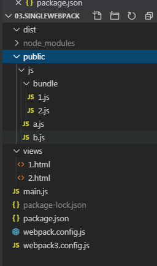

*目录解释：

  01.simplyHtml：这个文件夹是完整的基础版的，html的webpack多入口的静态打包方式。

  

* 以第一个文件夹01.simplyHtml的最简单的html 的多入口为例子
## 一：demo目的：
如何通过webpack和node来实现多个静态页面html,多个入口，能打包，能热加载，能开发环境调试，能生成dist里面的线上需要文件；

## 二：demo难点:
1.每个html都需要引入多个静态js，这时候配置入口文件就有问题？
	解决思路：把html的多个js,或者css的需要引入的静态文件，都通过一个js先引入进去，到时候直接引入这一个js就可以了。
2.如何动态获取到每个html的入口js作为webpack打包的入口文件？
	解决思路：通过glob这个插件来获取所有需要作为入口文件js的文件名，成为一个数组，然后循环这个数组，去拼接json的key:filename,value:filepath,这样就可以获取到完整的入口文件。
3.如何能在开发环境热加载这些打包后的静态文件，能实时刷新改动的内容？
	解决思路：不能用webpack-dev-server,因为现在是多个单页需要访问，用这个插件用到的"webpack-dev-middleware": "^1.12.2（这个版本过高会报错我这边。。，这个版本是可以的）" 和 "webpack-hot-middleware": "^2.25.0"，这两个插件来实现开发环境，读取内存里面的打包完的文件，然后通过名字匹配node的路由来进行访问；

## 三：目录结构
 

dist -- 打包后的文件存放地址，正式环境只需要这个里面的文件就可以了；
public -- 静态资源 图片,css，js 的存放地址；
public --> js --> bundle 这个文件夹是存放一个静态html对应一个js，且名字要和html的名字一致；
views -- 静态html的文件夹；
main.js - node启动项目入口js;
webpack.config.js -- 是webpack打包的入口

## 项目启动
先 npm install 安装包；
然后 本地开发运行  npm start；
发布到线上就使用 npm run prodbuild；

具体运行代码方式在 package.json里面 ：
 "scripts": {
    "start": "cross-env NODE_ENV=development node --inspect=9222 main.js",
    "prodbuild": "cross-env NODE_ENV=production npx webpack"
  },